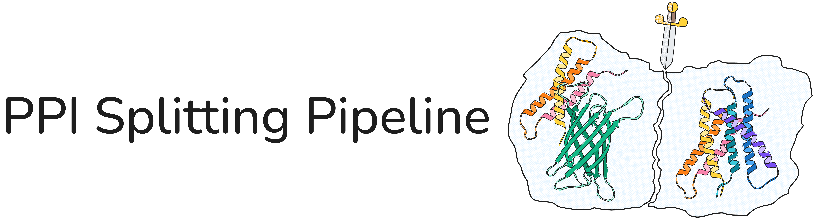

Automated leakage-aware splitting of a protein–protein interaction (PPI) dataset into train, validation, and test sets, with redundancy removal, negative sampling, embedding-based classification, and bias analysis.

With `--ddi_mode` the same pipeline splits **domain–domain interactions** (Pfam family pairs) instead of PPIs — see [DDI mode](#ddi-mode) below.

Have a look at the [Wiki](https://github.com/bionetslab/ppi-splitting-pipeline/wiki) for more information.


## Quick Start

### Input PPI File

To custom-split your PPI dataset, you need to provide it to the pipeline as a CSV file with at least two columns (`protein1`, `protein2`) containing UniProt accession IDs. Additional columns (e.g., STRING evidence scores) are preserved throughout the pipeline.

```
protein1,protein2
P45985,Q14315
Q86TC9,P35609
O14836-2,P12345
...
```

In DDI mode the file has exactly the same shape, but the two columns hold **Pfam
family accessions** and one row is one domain–domain interaction:

```
protein1,protein2
PF00069,PF00017
PF00069,PF00028
...
```

The column names don't change, so every downstream step reads the file the same way.

### Samplesheet preparation

You provide all parameters for the pipeline via a samplesheet CSV where one row corresponds to one run. E.g., :

| id        | ppis             | split_method | negative_sampling_method | neg_ilp_solver | gurobi_license     |
|-----------|------------------|--------------|--------------------------|----------------|--------------------|
| fast-run  | data/my_ppis.csv | kahip        | default                  |                |                    |
| split-ilp | data/my_ppis.csv | ilp          | default                  |                |                    |
| all-ilp   | data/my_ppis.csv | ilp          | ilp                      | gurobi         | path/to/gurobi.lic |

### Run the pipeline

If you have a GPU, `-profile gpu` will submit the embedding step to a GPU, as specified by your nextflow config.

```
nextflow run main.nf --samplesheet samplesheet.csv --outdir results -profile gpu -c my_config.config
```

In `my_config.config`, you have to specify where the GPU is located. SLURM example:

```
profiles {
    ...
    gpu {
        process {
            withLabel:process_gpu {
                queue = 'shared-gpu'
                clusterOptions = '--qos=limitgpus --gpus=a40:1 --exclude small-gpu'
            }
        }
    }
}
```

### View the report

The MultiQC report can be found at `results/multiqc/multiqc_report.html`, which you can view in a browser.

---

## Workflow


### Step descriptions

**FETCH_DATA** — Queries UniProt for the union of unique proteins across every samplesheet dataset that needs a fetch (extracted directly from each dataset's `protein1`/`protein2` columns and deduplicated, no PPI CSVs concatenated). Retrieves sequences (canonical + isoform-specific via the FASTA endpoint), GO annotations (biological process, molecular function, cellular component), and NCBI taxon IDs. Outputs `sequences.fasta`, `go_annotations.tsv`, and `species.tsv`, published to `results/_shared/data/`, then split back out per dataset (`SUBSET_FETCHED_DATA`) — see [Multiple datasets (samplesheet)](#multiple-datasets-samplesheet) below.

**FETCH_DOMAIN_META** — DDI mode only, replacing `FETCH_DATA`. Pools the Pfam family accessions across every dataset that needs a fetch and resolves them in one streaming pass over Pfam's bulk files, with no per-family API requests: `Pfam-A.fasta.gz` for the domain instances (already cut, so sequence and coordinates come from one release), `Pfam-A.clans.tsv.gz` for family → clan, and `speclist.txt` plus UniProt's reviewed-accession list for the sampling tiers. Samples up to `M` instances per family and writes `sequences.fasta` keyed by instance, `species.tsv`, a header-only `go_annotations.tsv` and `instances.tsv` — published to `results/_shared/data/`, then split back out per dataset (`SUBSET_DOMAIN_DATA`).

**GET_LENGTHS** — Computes per-protein sequence lengths for length-normalized BLAST scores. Runs once on the shared fetch batch (see above) for datasets needing a fetch, and once per dataset for datasets supplying a precomputed `sequences.fasta`.

**RUN_BLAST** — Runs all-against-all BLASTp with `makeblastdb` + `blastp` to quantify pairwise sequence similarity. In DDI mode the sequences are domain instances rather than full chains; the invocation is identical.

**MAKE_METIS** — Converts the BLAST results into a weighted similarity graph in METIS format. Edge weights are either raw bitscore or bitscore normalised by the geometric mean of protein lengths. In DDI mode it contracts instances onto their Pfam **clan**: instance–instance hits collapse to one weight per clan pair, taking the best hit, and hits within a clan are skipped. Clan-mates are then the same node, so no split can separate them.

**RUN_KAHIP** — Partitions the similarity graph into `k` parts using KaHIP's `kaffpa`. 

- k=3 is used togehter with **SORT_PPIS** to produce the final splits. The largest partition is used as the training set, the second-largest as validation, and the smallest as test.
- k=100 is used together with **SOLVE_ILP**. The clusters are moved to training, validation, and test set while minimizing the data loss and satisfying the constraints.

**SORT_PPIS** — Assigns each PPI to a split based on the KaHIP partition. PPIs are only retained if both partners occur in the same block of the partition. Writes per-split CSV and FASTA files. Note this path **ignores `train_split`/`val_split`/`test_split`** — the split sizes are whatever the three ranked KaHIP blocks happen to be.

**SOLVE_ILP** — Assigns each PPI to a split by solving a mixed-integer linear program (CVXPY) that maximizes the number of retained PPIs while satisfying constraints (each cluster is assigned to 1 split, and each split holds its `train_split`/`val_split`/`test_split` share of the retained interactions — 0.8/0.1/0.1 by default — within `ilp_epsilon`). A fraction of `0` is legal: that split is left out of the model and comes out empty rather than missing, so every later step still sees three splits. The ILP solver is Gurobi, by default, with the gurobi license file specified via `--gurobi_license`. If no license is available, the open-source solvers SCIP or HiGHS can be used instead.

**SPLIT_RANDOM** — `split_method=random`: a deliberately naive baseline that shuffles PPIs and slices them into train/val/test by proportion only, ignoring sequence similarity or topology entirely. Doesn't discard any PPIs, and its output skips `CDHIT2D`/`REMOVE_REDUNDANT` entirely — see [Naive baseline: the topology shortcut](#naive-baseline-the-topology-shortcut-optional) below.

**CDHIT2D** – Calls CD-HIT 2D between train/val and train/test to identify proteins in val/test that are too similar to any training protein (above the CD-HIT identity threshold). Writes a TSV of redundant proteins for each split. Only runs for `kahip`/`ilp` splits. In DDI mode it compares domain instances.

**REMOVE_REDUNDANT** — Removes proteins from val and test that are too similar to any training protein using the CD-HIT 2D TSVs. Only runs for `kahip`/`ilp` splits. Its kept-vs-removed counts feed into the same "PPI Partitioning" chart `SORT_PPIS`/`SOLVE_ILP` started (stacked `Kept` vs `Removed (CD-HIT)` for the `train`/`val`/`test` bars). In DDI mode the verdict is taken one level up and strictly: a family survives only if *every* one of its instances in that split survived, and dropping a family drops every DDI touching it.

**SELECT_EXAMPLES** — DDI mode only. Picks up to `N` domain-instance pairs ("examples") per surviving DDI under one rule: **no parent protein may be used by more than one split**. That rule couples the splits — claiming a protein for train takes it away from test — so it is solved as one ILP (CVXPY) over all three splits at once, and only over the proteins two splits actually compete for; the rest is a local pick. Candidate pairs are any instance of family A × any instance of family B, preferring distinct parents over reusing one, and `candidate_network` pairs claim their parents in the same ILP. Emits the per-split example tables, each split's **protein universe** (the parents it claimed), the proteins no candidate ever reached (`unclaimed.txt`), the DDI lists with zero-example DDIs removed, and a drop report.

**SAMPLE_NEGATIVES_DEGREE** — Samples random negative pairs for each split. By default, negatives are drawn such that each protein's degree distribution is approximately preserved, producing a balanced test set (1:1 positive:negative) and a realistic test set (1:10 ratio). With `negative_sampling_method=uniform`, endpoints are instead drawn fully uniformly at random for *every* split (not just the realistic test set) — see [Naive baseline: the topology shortcut](#naive-baseline-the-topology-shortcut-optional) below.

**SAMPLE_NEGATIVES_ILP** – An ILP-based alternative satisfying the size constraints while minimizing biases between the positive and negative sets; see [Bias-aware ILP negative sampling](#bias-aware-ilp-negative-sampling-optional) below.

**EXPAND_NEGATIVES** — DDI mode only. Both samplers draw negatives as family pairs; this step turns them into the instance pairs the classifier trains on. Positives are copied from `SELECT_EXAMPLES` rather than redrawn, and each negative family pair gets up to `N` instance pairs from that split's own protein universe, drawn by the same rule the positives were — topped up from the never-claimed proteins when the universe is too thin. Nothing is resampled to repair the ratio: a negative pair can end up with fewer than `N` examples, so the example-level ratio can drift from the family-level one. Both are reported.

**EMBED_SEQUENCES** — Computes per-protein embeddings using the selected model:
- `none` — 21-dimensional mean-pooled one-hot amino acid composition
- `esm2` — ESM-2 650M (dimension 1280), mean-pooled over residues
- `prot_t5` — ProtT5-XL (dimension 1024), mean-pooled over residues
- A path to a pre-computed `.npz` file skips this step entirely.

Every samplesheet dataset requesting the same model is embedded together in
one call over the union of their train/val/test sequences, published once to
`results/_shared/embeddings/embeddings_<model>.npz` (not duplicated per
dataset).

**TRAIN_CLASSIFIER** — Trains a Random Forest classifier on concatenated pair embeddings. Hyperparameters are tuned on the validation AUROC over 3 configurations (max_depth 5/10/30, max_samples 0.2), then the best model is retrained on train+val and evaluated on the balanced and realistic test sets. When the labelled CSVs carry the DDI mode `family1`/`family2` columns it additionally averages each DDI's example predictions and scores at family level, in a second table per test split ("Classifier Performance, DDI level"). Hyperparameter selection stays on example-level validation AUROC in both modes.

**BIAS_ANALYSIS** — Runs in parallel for each attribute, computing:
- *Utility* — NMI(A; Y) = MI / √(H(A)·H(Y)): how much the attribute is correlated with the PPI label
- *Detectability* — Spearman ρ of a Ridge regressor predicting the attribute from pair embeddings

Attributes analyzed:

| Attribute                         | Description                                                                                                                                                                                                                                                                                                                                          |
|-----------------------------------|------------------------------------------------------------------------------------------------------------------------------------------------------------------------------------------------------------------------------------------------------------------------------------------------------------------------------------------------------|
| `sequence_similarity`             | BLASTp pident between the two proteins, normalized to [0, 1]                                                                                                                                                                                                                                                                                         |
| `embedding_similarity`            | Cosine similarity of the two individual protein embeddings                                                                                                                                                                                                                                                                                           |
| `functional_relatedness_BP/MF/CC` | Jaccard similarity of GO term sets (biological process / molecular function / cellular component)                                                                                                                                                                                                                                                    |
| `self_interactions`               | 1 if both proteins are identical, 0 otherwise                                                                                                                                                                                                                                                                                                        |
| `same_species`                    | 1 if both proteins share the same NCBI taxon ID, 0 otherwise (only included if the dataset contains proteins from more than one species)                                                                                                                                                                                                             |
| `topology_shortcut`               | Each endpoint's training positive-rate (pos / (pos + neg) training degree), using whichever endpoint(s) occurred in training; only included if at least one val/test/test_balanced/test_realistic pair has an endpoint that occurred in training — see [Naive baseline: the topology shortcut](#naive-baseline-the-topology-shortcut-optional) below |
| `parent_degree`                   | DDI mode only. How often each of the pair's two parent proteins is reused within the same split, averaged over the two. Positives and negatives are drawn the same way from the same protein universe, so this should carry no label information — a nonzero NMI means one class reuses its parents more than the other                                 |

DDI mode drops the three `functional_relatedness_*` attributes (Pfam families carry no GO
annotations) and adds `parent_degree`. `sequence_similarity`, `embedding_similarity` and
`same_species` are unchanged, acting on the two domain instances the row holds.
`self_interactions` and `topology_shortcut` instead act on the row's Pfam family pair (its
`family1`/`family2` columns): `self_interactions` becomes "is this a self-DDI", which also
catches a pair of two *different* instances of one family, and `topology_shortcut` becomes
family degree in the DDI graph rather than protein degree.

**COLLECT_BIAS** — Aggregates all per-attribute TSVs into a single interactive Plotly scatter plot (NMI vs detectability, colored by attribute, shaped by split).

**SIMILARITY_HEATMAP** — Plots a heatmap of pairwise BLASTp similarity between proteins in different splits, to visualize the degree of leakage.

**DDI_ATTRITION** — DDI mode only. One stacked bar per dataset accounting for every input DDI: discarded cross-cluster by the partitioner, removed by CD-HIT-2D, dropped because no domain-instance example was left for it, or kept. The counts are read back out of the DDI Partitioning and DDI Example Selection bars rather than re-derived, so the waterfall and the per-stage charts cannot disagree.

**MULTIQC** — Collects every dataset's `*_mqc.tsv`/`*_mqc.html` files into one combined report for the whole run (`results/multiqc/`). Per-attribute bias tables are excluded (the bias-scatter plot supersedes them); General Statistics, Classifier Performance, Positive vs Negative Pairs, and (in DDI mode) DDI Instance Expansion and DDI Attrition are merged across datasets (qualified sample names + an `ID` column); PPI/DDI Partitioning, DDI Example Selection, the similarity heatmap, and the bias-scatter plot remain one separate panel per dataset.

---

## Outputs

Every dataset from the samplesheet gets its own subtree under `--outdir`, named by its `id` column. Work shared across datasets (the deduplicated UniProt fetch and any embeddings shared by datasets requesting the same model) lives under a separate `_shared/` folder rather than being duplicated into every dataset's subtree. The combined MultiQC report for the whole run lives at the top level, `results/multiqc/`:

```
results/
├── _shared/
│   ├── data/                         # One deduplicated UniProt fetch batch (see Multiple datasets below)
│   │   └── sequences.fasta, go_annotations.tsv, species.tsv
│   └── embeddings/
│       └── embeddings_<model>.npz    # One file per distinct embedding_model requested across datasets
├── multiqc/
│   ├── multiqc_report.html           # One combined report for the whole run
│   └── multiqc_report_data/          # MultiQC data folder
└── <id>/
    ├── multiqc/
    │   └── similarity_heatmap.html   # Standalone copy of this dataset's heatmap (also embedded in the combined report)
    ├── data/
    │   └── go_annotations.tsv        # GO annotations for this dataset's own proteins
    │   └── sequences.fasta           # FASTA for this dataset's own proteins
    │   └── species.tsv               # NCBI taxon IDs for this dataset's own proteins
    ├── similarities/
    │   └── all_vs_all.tsv            # BLAST evalue, bitscore and pident between this dataset's own proteins
    │   └── similarity.graph          # KaHIP input graph = all vs. all similarity graph (weighted edges) in METIS format
    │   └── node_mapping.tsv          # KaHIP just enumerates nodes, this maps them to protein IDs
    │   └── partitioned_proteome.txt  # KaHIP partitioned proteome (protein IDs) 
    ├── train.csv                     # Final labelled splits (positives + negatives)
    ├── val.csv
    ├── test_balanced.csv
    └── test_realistic.csv            # with 1:10 ratio of positives:negatives, negatives are uniformly sampled
```

`data/sequences.fasta` (and its `go_annotations.tsv`/`species.tsv`) is
always this dataset's own subset, even for datasets whose UniProt fetch was
folded into a shared batch with other datasets — this matters most for
`similarities/all_vs_all.tsv`, since BLAST's E-value/bitscore statistics
depend on exactly which proteins are in its search database, so it always
runs per-dataset even when the underlying sequences came from a shared fetch.

DDI mode keeps this layout and adds a few files to it — `data/instances.tsv`, an
`examples/` folder, and the instance-level `{split}_instances.csv` next to the
family-level `{split}.csv`; see [DDI mode](#ddi-mode) below.

---

## Multiple datasets (samplesheet)

`--samplesheet` takes a CSV with one row per PPI dataset. Only `id` and `ppis`
are required — every other column may be left blank, in which case that
dataset falls back to the corresponding `nextflow.config` default. This makes
it possible to process several datasets with different parameters in a single
`nextflow run` invocation, all running in parallel:

```
id,ppis,split_method,negative_sampling_method,cdhit_identity,neg_ilp_lambda_jaccard
hippie,data/HIPPIE-current.csv,,,,
string,data/string.csv,ilp,ilp,0.5,0.5
```

| Column                                                                                                     | Overrides                   | Notes                                                                                                                                                                                                                                                   |
|------------------------------------------------------------------------------------------------------------|-----------------------------|---------------------------------------------------------------------------------------------------------------------------------------------------------------------------------------------------------------------------------------------------------|
| `id`                                                                                                       | —                           | Required. Used as the output subfolder name (`results/<id>/...`) and in logs.                                                                                                                                                                           |
| `ppis`                                                                                                     | —                           | Required. Path to this dataset's PPI CSV — or, under `--ddi_mode`, its DDI CSV (same two columns, Pfam accessions).                                                                                                                                      |
| `sequences`, `go_annotations`, `species`                                                                   | UniProt fetch step          | Supply all three to skip `FETCH_DATA` for this dataset. In DDI mode `go_annotations` is unused and the trio is `sequences`, `species`, `domain_instances` instead.                                                                                       |
| `domain_instances`                                                                                         | Pfam fetch step             | DDI mode only. A precomputed `instances.tsv`; supply it together with `sequences` and `species` to skip `FETCH_DOMAIN_META` for this dataset.                                                                                                            |
| `blast_results`                                                                                            | BLAST step                  | Supply to skip `RUN_BLAST` for this dataset (a precomputed `all_vs_all.tsv`).                                                                                                                                                                           |
| `candidate_network`                                                                                        | —                           | Optional candidate pool CSV for the ILP negative sampler — high-confidence non-interacting *family* pairs in DDI mode, where it also feeds `SELECT_EXAMPLES`. Supplied per row only; it has no `nextflow.config` default.                                 |
| `partition`, `node_mapping`                                                                                | Clustering step             | Only read when `--split_only` is set (see [Best-practice short run](#best-practice-short-run---split_only) below) — a precomputed `partitioned_proteome.txt`/`node_mapping.tsv` pair that lets that mode skip `CLUSTERING` entirely. Ignored otherwise. |
| `embedding_model`, `cdhit_identity`, `cdhit_wordsize`                                                      | `params.*` of the same name | Defaults: `embedding_model`: esm2, `cdhit_identity`: 0.4, `cdhit_wordsize`: 2                                                                                                                                                                           |
| `split_method`, `edge_weight`, `kahip_k`, `ilp_kahip_k`, `ilp_epsilon`                                     | `params.*` of the same name | Defaults: `split_method`: kahip (k=3), `edge_weight`: normalized_bitscore, `kahip_k`: 3, `ilp_kahip_k`: 100, `ilp_epsilon`: 0.05. `split_method=random` is a naive baseline, see below                                                                  |
| `train_split`, `val_split`, `test_split`                                                                   | `params.*` of the same name | Defaults: 0.8, 0.1, 0.1. Must sum to 1; any one of them may be `0` (that split then comes out empty). Only `ilp` and `random` read them — `kahip` sizes its splits from the KaHIP blocks themselves                                                       |
| `negative_sampling_method`                                                                                 | `params.*` of the same name | Defaults: default (alternatives: ilp, uniform — see below)                                                                                                                                                                                              |
| `neg_ilp_lambda_degree`, `neg_ilp_lambda_taxon_pair`, `neg_ilp_lambda_self_loop`, `neg_ilp_lambda_jaccard` | `params.*` of the same name | Only used when `negative_sampling_method` is `ilp`; see [Bias-aware ILP negative sampling](#bias-aware-ilp-negative-sampling-optional) below. Highly dataset-specific, so overridable per row rather than fixed run-wide. `--ddi_mode` forces `neg_ilp_lambda_jaccard` to 0 regardless of the row, since that term matches GO overlap and DDI mode has no GO annotations. |

Everything else (solver settings, Gurobi license, resource limits, seeds,
...) stays a run-wide default in
`nextflow.config` and is shared by every dataset in the samplesheet.

**Deduplicated work across datasets.** Datasets often overlap in which
proteins they contain, so two things are computed once per run rather than
once per dataset:
- **UniProt fetch**: every dataset that needs a fetch (doesn't supply
  `sequences`/`go_annotations`/`species`) has its unique proteins extracted
  and pooled with every other such dataset's, fetched together once, then
  split back out per dataset. BLAST still runs once per dataset on its own
  subset — see [Outputs](#outputs) above for why that matters. In DDI mode the
  same holds for the Pfam pass: one stream per run, not one per dataset.
- **Embeddings**: every dataset requesting the same `embedding_model` shares
  one embedding computation over the union of their sequences.

Both are purely a compute/storage optimization — a dataset in a mixed run
with others produces the same `train.csv`/`val.csv`/etc. it would if run
alone.

---

## Best-practice short run (`--split_only`)

For a quick, opinionated run that only produces the leakage-aware splits —
without embedding/training a baseline classifier or building the bias/MultiQC
report — skip straight to the ILP-based splitting core:

```bash
nextflow run main.nf --samplesheet samplesheet.csv --outdir results --split_only
```

`--split_only` runs only `SOLVE_ILP` → `CDHIT2D` → `REMOVE_REDUNDANT` →
`SAMPLE_NEGATIVES_ILP`, then stops — `FETCH_DATA`, `CLUSTERING` (`RUN_BLAST`/
`MAKE_METIS`/`RUN_KAHIP`), `TRAIN_BASELINE`, and `QC` never run. Because of
that, every samplesheet row must supply all of the following (no fallback to
fetching/computing them):

| Column           | Precomputed file                   |
|------------------|------------------------------------|
| `ppis`           | PPI CSV                            |
| `sequences`      | `sequences.fasta`                  |
| `go_annotations` | `go_annotations.tsv`               |
| `species`        | `species.tsv`                      |
| `partition`      | KaHIP's `partitioned_proteome.txt` |
| `node_mapping`   | `node_mapping.tsv`                 |

Under `--ddi_mode` the required set is the same except that `go_annotations`
(unused there) is replaced by `domain_instances`, and the partition is over clans
rather than proteins. `SELECT_EXAMPLES` still runs: in DDI mode the example tables
are the deliverable.

`candidate_network` remains optional, same as a normal run. `split_method`
and `negative_sampling_method` are forced to `ilp` regardless of what the
samplesheet says, since that's the only path this mode runs. Everything else
(`cdhit_identity`, `ilp_epsilon`, the `neg_ilp_*` weights, `--gurobi_license`/
`--ilp_solver`/`--neg_ilp_solver`, ...) still applies exactly as in a full run
— see [Bias-aware ILP negative sampling](#bias-aware-ilp-negative-sampling-optional)
above for those. The output is the same four files a full run produces —
`results/<id>/{train,val,test_balanced,test_realistic}.csv` — just without
the classifier/bias/MultiQC steps built on top of them.

---

## DDI mode

`--ddi_mode` splits **domain–domain interactions** — pairs of Pfam families —
instead of PPIs. Most of it is a relabelling: once the clustering node is a Pfam
**clan**, a DDI is an ordinary pairwise edge, so the partitioner, the ILP and the
negative samplers keep their exact meaning while proteins become clans and PPIs
become DDIs.

```bash
nextflow run main.nf --samplesheet samplesheet_ddi.csv --ddi_mode --outdir results -profile conda

# smoke test on the committed list of real Pfam family pairs (queries Pfam live)
nextflow run main.nf -profile test_ddi,conda
```

The input is the two-column CSV from [Input PPI File](#input-ppi-file) with Pfam
accessions in it, and that is all a row needs: domain sequences, parent taxa and
the family → clan map all come from the Pfam pass in `FETCH_DOMAIN_META`.

### What it guarantees

- **One split per DDI, and clan-mates never separated.** Neither needs enforcing:
  a family sits in exactly one clan, and a clan in exactly one split.
- **No domain homology between splits** — the pipeline's usual homology barrier
  (KaHIP partition, then CD-HIT-2D), on domain instances. The CD-HIT verdict is taken per
  family and strictly: one redundant instance drops the family and every DDI
  touching it.
- **No parent protein in two splits.** `SELECT_EXAMPLES` applies this when it
  picks examples, rather than the partitioner applying it up front: as a
  partitioning constraint — "families sharing a parent must co-assign" — a handful
  of multi-domain hub proteins would chain families together transitively and pull
  most of the graph into one split.
- **Self-DDIs are kept**, positive and negative — dropping them while keeping
  self-DDI positives would make "same family ⇒ positive" a free shortcut.
- **No functional annotation.** Pfam families carry no GO terms, so the three
  `functional_relatedness_*` bias attributes and the negative sampler's Jaccard
  term go inactive, and `parent_degree` replaces them.

### Examples: `N` and `M`

A DDI's evidence is concrete domain-instance pairs, drawn purely from
co-occurrence — any instance of family A × any instance of family B, no PPI
network involved. Two counts govern that:

- **`M`** = `ddi_examples_pool_factor` × `N` instances sampled per family, in tier
  order (human-reviewed → human → reviewed → any, at random within a tier). This
  is all that BLAST, CD-HIT and the classifier ever see of a family. An empty tier
  is ordinary, not an error.
- **`N`** = `ddi_examples_target` examples kept per DDI — a cap, not a quota. A
  DDI with fewer available keeps what it has; only one left with *zero* is
  dropped, and reported.

Instance ids are `family_protein_start_end`, e.g. `PF00069_P12345_10_250`, and
`data/instances.tsv` maps each one back to its family, clan, parent protein,
coordinates, taxon and source database.

### Parameters

| Parameter                  | Default | Description                                                                                                                                     |
|----------------------------|---------|-------------------------------------------------------------------------------------------------------------------------------------------------|
| `ddi_mode`                 | `false` | Interpret the interaction file's two columns as Pfam family accessions                                                                          |
| `ddi_examples_target`      | `5`     | `N`, the cap on examples kept per DDI                                                                                                           |
| `ddi_examples_pool_factor` | `1`     | `M` = this × `N`, the instances sampled per family                                                                                              |
| `ddi_select_max_sec`       | `300`   | Time limit for the `SELECT_EXAMPLES` ILP; on running out it keeps the best solution found and warns                                             |
| `ddi_lambda_diversity`     | `0.1`   | How strongly a DDI's examples prefer distinct parents (`P1-P2, P3-P4` over `P1-P2, P1-P3`). Must stay below 0.5, so it never costs a DDI an example |
| `ddi_shortlist_factor`     | `4`     | Cap on a DDI's candidate pool before the ILP, as a multiple of `N`. A no-op at `M = N`, a guard for a larger pool                               |
| `ddi_candidate_factor`     | `4`     | Cap on `candidate_network` pairs per split, as a multiple of that split's DDI count                                                             |
| `ddi_select_verbose`       | `false` | Let the `SELECT_EXAMPLES` solver print its own log to `.command.err`. Off by default: one block per ILP solve, which is large at real DDI counts |
| `pfam_fasta`               | `null`  | Local `Pfam-A.fasta.gz`, skipping the ~6.3 GB download                                                                                          |
| `pfam_clans`               | `null`  | Local `Pfam-A.clans.tsv(.gz)`, skipping that download                                                                                           |
| `interpro_cache`           | `null`  | Directory for the cached downloads. A convenience only: a cold run produces identical output                                                     |

`SELECT_EXAMPLES` reuses `--ilp_solver` and `--gurobi_license` rather than adding
its own; every other parameter (`cdhit_*`, `ilp_*`, `neg_ilp_*`, the split
fractions) keeps its usual meaning.

### Extra outputs

DDI mode publishes the same tree as PPI mode (see [Outputs](#outputs)) plus:

```
results/<id>/
├── data/
│   └── instances.tsv                            # instance -> family, clan, parent protein, coords, taxon
├── examples/
│   ├── {train,val,test}_sel.csv                 # the split's DDIs, zero-example ones removed
│   ├── {train,val,test}_examples.csv            # the selected instance pairs
│   ├── {train,val,test}_candidate_examples.csv  # the same, for candidate_network negatives
│   ├── {train,val,test}_universe.txt            # the parent proteins this split claimed; no other split may use them
│   └── unclaimed.txt                            # parents no candidate example reached -- the spare pool
├── {train,val,test_balanced,test_realistic}.csv            # family-level labelled pairs
└── {train,val,test_balanced,test_realistic}_instances.csv  # instance-level -- what the classifier trains on
```

The instance-level files carry `protein1,protein2,label` plus `family1,family2`.
Those two extra columns are how `TRAIN_CLASSIFIER` and `BIAS_ANALYSIS` recognise
DDI mode — neither takes a flag for it.

### Reading the report

The MultiQC report gains "DDI Partitioning", "DDI Example Selection", "DDI
Instance Expansion" and "DDI Attrition" — the last a single stacked bar per
dataset accounting for every input DDI (discarded cross-cluster, removed by
CD-HIT-2D, dropped for want of an example, or kept). Each test split gets two
classifier tables, one per example and one per DDI, the latter averaging a DDI's
example predictions before scoring. On the per-DDI table read **AUROC and
AUPRC**: averaging `N` near-chance probabilities pulls every DDI toward the same
mean, so a fixed 0.5 cut — and F1/MCC/precision/recall with it — says little until
the model clears chance.

`bin/other/check_ddi_invariants.py --results results/<outdir>` re-checks the whole
published tree: no parent protein and no family in two splits, no DDI over `N`,
and every id really an instance of the family it claims.

### Worth knowing

- `split_method=random` is the leaky baseline here too: it skips CD-HIT **and** the
  one-protein-per-split rule, so families and parent proteins may straddle splits.
  That is exactly the leakage the baseline exists to show.
- `cdhit_identity` 0.4 and `cdhit_wordsize` 2 are CD-HIT's own floor, so on ~100 aa
  domains no stricter homology cut is reachable through CD-HIT. The strict
  per-family verdict above is what compensates.
- BLAST runs as in PPI mode — no `-evalue`, hence `blastp`'s default of 10 — which
  keeps the two modes comparable but over-connects the clan graph on short
  sequences. That errs in the safe direction: KaHIP then separates harder, so more
  DDIs are discarded as cross-cluster and less leakage survives.
- Accessions Pfam has killed between releases are named in the fetch report and
  their DDIs drop out; one unresolvable accession never aborts a run.
- Positives and negatives are drawn the same way, from the same per-split protein
  universe, so DDI mode avoids PPI mode's asymmetry — there, positives come from
  real complexes and negatives from pairs merely not known to interact, which is
  itself learnable. `parent_degree` is the check: a nonzero NMI means one class
  reuses its parents more than the other.

---

## Naive baseline: the topology shortcut (optional)

Many PPI-splitting publications randomly split pairs 80/10/10 and sample
negatives uniformly at random. This inflates reported performance: positive
degree follows a power law while uniform-random negatives don't, so a
protein's *training* degree — specifically what fraction of its training
interactions are positive, `pos_degree_in_training(p) /
(pos_degree_in_training(p) + neg_degree_in_training(p))` — becomes
predictive of the label by itself, especially for proteins at the extremes
of the degree distribution. A model can exploit this "topology shortcut"
instead of learning any real interaction signal, because a naive random
split lets the same protein land in both training and test.

Reproduce this deliberately-bad setup with:

```bash
nextflow run main.nf --split_method random --negative_sampling_method uniform
```

(or per-dataset via the samplesheet's `split_method`/`negative_sampling_method`
columns, see [Multiple datasets](#multiple-datasets-samplesheet) above).
`split_method=random` (`SPLIT_RANDOM`) shuffles PPIs and slices them by
proportion only — no homology- or topology-aware partitioning — and,
critically, **skips `CDHIT2D`/`REMOVE_REDUNDANT` entirely**: since those
steps treat a protein shared between train and test as trivially
~100%-self-similar and strip it back out of test, running them here would
erase almost all of the train/test protein overlap this baseline exists to
demonstrate. `negative_sampling_method=uniform` draws negatives fully
uniformly at random for every split (not just the realistic test set),
matching how the "many publications" this baseline is modeled on sample
negatives.

The `topology_shortcut` bias attribute (see the Attributes table above)
quantifies exactly this effect: it's only computed for pairs where at least
one endpoint occurred in training, and the whole attribute is skipped (no
MultiQC output at all) when *no* val/test/test_balanced/test_realistic pair
qualifies — which is the normal, expected case for the real `kahip`/`ilp`
splits, since those keep train/val/test protein sets disjoint by design.
Run a `random`-split dataset alongside a `kahip`/`ilp`-split dataset on the
same PPI data in one samplesheet to see the difference directly: the naive
baseline's report will show a `topology_shortcut` table with elevated
NMI/detectability that the leakage-aware splits' reports won't show at all.

---

## Bias-aware ILP negative sampling (optional)

`SAMPLE_NEGATIVES_ILP` is an opt-in alternative to `SAMPLE_NEGATIVES` that chooses
the negative set by solving a mixed-integer linear program (CVXPY), rather than
sampling at random. It matches per-protein degree, per-taxon-pair interaction
counts, self-interaction counts, and mean GO-BP Jaccard similarity between the
positive and negative sets. `bin/sample_negatives_ilp.py` samples exactly one
split per invocation; the process runs once per split (train, val,
test_balanced) and Nextflow executes all three in parallel. `test_realistic`
is deliberately excluded — same as under `negative_sampling_method=default`,
it always gets uniform-at-random negatives (via `SAMPLE_NEGATIVES_DEGREE`)
regardless of `negative_sampling_method`, since the point of that split is to
simulate an uncontrolled random screen, and bias-matching its negatives to
the positives would defeat that purpose. Together they produce the same four 
output files (`train.csv`, `val.csv`, `test_balanced.csv`, 
`test_realistic.csv`) as the default sampler, so all downstream steps are 
unaffected. 

Enable it with:

```bash
nextflow run main.nf --negative_sampling_method ilp
```

The `--neg_ilp_lambda_*` weights are highly
dataset-specific (they depend on each dataset's degree distribution, taxon
composition, and GO annotation coverage), so when running multiple datasets
via `--samplesheet` they are set **per row**, not as a single run-wide value —
see the samplesheet column reference in
[Multiple datasets (samplesheet)](#multiple-datasets-samplesheet) above. The
values below are just the `nextflow.config` fallback used for any row that
leaves them blank.

| Parameter                   | Default   | Description                                                                                                                                                              |
|-----------------------------|-----------|--------------------------------------------------------------------------------------------------------------------------------------------------------------------------|
| `negative_sampling_method`  | `default` | `default` (random) or `ilp`                                                                                                                                              |
| `candidate_network`         | —         | Optional CSV (`protein1,protein2`) restricting the candidate pool, e.g. a Negatome database or a topology-driven pool. Samplesheet column only — there is no `nextflow.config` default. Recommended for large protein universes (see below). |
| `neg_ilp_lambda_degree`     | `1.0`     | Weight of the per-protein aggregate degree-matching term                                                                                                                 |
| `neg_ilp_lambda_taxon_pair` | `1.0`     | Weight of the global taxon-pair matching term                                                                                                                            |
| `neg_ilp_lambda_self_loop`  | `1.0`     | Weight of the self-interaction count matching term                                                                                                                       |
| `neg_ilp_lambda_jaccard`    | `1.0`     | Weight of the mean GO-BP Jaccard matching term. Forced to 0 under `--ddi_mode` (no GO annotations), which skips the term outright rather than matching an all-zero one     |
| `neg_ilp_solver`            | `auto`    | `auto`, `gurobi`, `scip`, or `highs`. `auto` tries Gurobi first, then falls back to an open-source solver.                                                               |
| `neg_ilp_time_limit`        | `7200`    | Solver time limit in seconds                                                                                                                                             |
| `neg_ilp_mip_gap`           | `0.01`    | Solver MIP gap tolerance                                                                                                                                                 |
| `gurobi_license`            | `"gurobi.lic"` | Path to a Gurobi license file, only used if the `gurobi` solver is selected. It is staged with `checkIfExists`, so a nonexistent path fails the run at channel construction |

For Gurobi, install it yourself and point `--gurobi_license` at your license
file (`pip install gurobipy` is already pulled in by `environment.yml`). With
no usable Gurobi license, `auto` falls back to SCIP or HiGHS, both installed
by `environment.yml`.

The default candidate pool is the full upper-triangle complement of the
positive set, which is quadratic in the number of proteins (~1.1×10⁸ pairs for
15k proteins). If it exceeds the process's candidate cap, the pool is randomly
subsampled instead of built in full — weighted toward each protein's own
negative-degree cap rather than uniformly, so a low-degree protein doesn't end
up with far more candidates than it can ever use. That cap is not a parameter:
`SAMPLE_NEGATIVES_ILP` sets it to 4× the split's positive count (raised on each
retry attempt) and passes it to `bin/sample_negatives_ilp.py --max-candidates`.
For large datasets, supply `candidate_network` to restrict the pool to a
deliberately-curated set instead (e.g. a Negatome database or a topology-driven
pool); if that network is itself larger than the cap, it's capped down the same
degree-weighted way rather than used in full.

Each split's process writes its own `<split>_mqc.tsv` diagnostics row and,
optionally, `<split>_residuals_mqc.tsv` (per-protein degree residuals); MultiQC
picks up all of them.

In DDI mode both samplers run exactly as described here, one level up: the pairs
they draw are Pfam family pairs on the family DDI graph, and `EXPAND_NEGATIVES`
then turns them into domain-instance pairs.

---

## Standalone STRING channel analysis

To investigate which STRING evidence channels explain classifier performance differences between datasets, use the standalone script (not part of the Nextflow pipeline):

```bash
python bin/analyse_string_channels.py \
    --train      results/<id>/train.csv \
    --test       results/<id>/test_balanced.csv \
    --embeddings results/_shared/embeddings/embeddings_<model>.npz \
    --out        string_channel_analysis.tsv
```

This fits a Ridge regressor (on positive pairs only) to predict each STRING evidence channel score from pair embeddings, and reports train and test Spearman ρ per channel. `combined_score` is excluded since it is derived from the individual channels.

---

## Requirements

- [Nextflow](https://www.nextflow.io/) ≥ 23.10
- Conda (for the environment) — or install the packages in `environment.yml` manually
- Internet access for the initial UniProt fetch (subsequent runs use cached Nextflow work directories)
- A GPU is recommended but not required for `esm2` and `prot_t5` embedding models
- For DDI mode, internet access for the Pfam pass — one ~6.3 GB transfer per run, or none if `--pfam_fasta`/`--pfam_clans` point at local copies. `--interpro_cache <dir>` makes repeat runs a stat and a read
