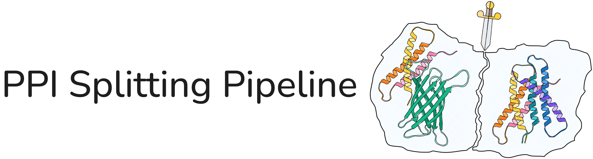
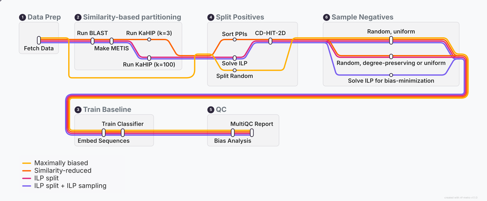

Automated leakage-aware splitting of a protein–protein interaction (PPI) dataset into train, validation, and test sets, with redundancy removal, negative sampling, embedding-based classification, and bias analysis.

With `--ddi_mode` the same pipeline splits **domain–domain interactions** (Pfam family pairs) instead of PPIs — see [DDI mode](#ddi-mode) below.

Have a look at the [Wiki](https://github.com/bionetslab/ppi-splitting-pipeline/wiki) for more information.



---
## Requirements

- [Nextflow](https://www.nextflow.io/) ≥ 26
- Conda (for the environment) — or install the packages in `environment.yml` manually, or use `-profile docker` and the image built from `docker/Dockerfile`
- Internet access for the initial UniProt fetch (subsequent runs use cached Nextflow work directories)
- A GPU is recommended but not required for `esm2` and `prot_t5` embedding models. It is required under `-profile gpu`, which turns an unusable CUDA device into an error instead of a slow CPU run. The wheel's CUDA major version must not exceed the driver's (minors are compatible). `environment.yml` pins `torch==2.10.0+cu128` for that reason, and `docker/Dockerfile` installs from that same file, so `-profile conda` and `-profile docker` cannot disagree about the wheel
- For DDI mode, internet access for the Pfam pass — one ~4.7 GB transfer plus a ~600 MB Swiss-Prot flat file per run, or none if `--pfam_regions`/`--pfam_clans`/`--uniprot_dat` point at local copies (a TrEMBL file has to be local: it is never downloaded). `--interpro_cache <abs-dir>` makes repeat runs a stat and a read (plus one small `Pfam.version` request, which `--pfam_release` removes)

---

## Quick Start

### Input PPI File

To custom-split your PPI dataset, you need to provide it to the pipeline as a CSV file with at least two columns (`protein1`, `protein2`) containing UniProt accession IDs. Additional columns (e.g., STRING evidence scores) are preserved throughout the pipeline.

```
protein1,protein2
P45985,Q14315
Q86TC9,P35609
O14836-2,P12345
...
```

In DDI mode the file has exactly the same shape, but the two columns hold **Pfam
family accessions** and one row is one domain–domain interaction:

```
protein1,protein2
PF00069,PF00017
PF00069,PF00028
...
```

The column names don't change, so every downstream step reads the file the same way.

### Samplesheet preparation

You provide all parameters for the pipeline via a samplesheet CSV where one row corresponds to one run. E.g., :

| id        | ppis             | split_method | negative_sampling_method | neg_ilp_solver | gurobi_license     |
|-----------|------------------|--------------|--------------------------|----------------|--------------------|
| fast-run  | data/my_ppis.csv | kahip        | default                  |                |                    |
| split-ilp | data/my_ppis.csv | ilp          | default                  |                |                    |
| all-ilp   | data/my_ppis.csv | ilp          | ilp                      | gurobi         | path/to/gurobi.lic |

### Run the pipeline

If you have a GPU, `-profile gpu` will submit the embedding step to a GPU, as specified by your nextflow config.
It also makes `EMBED_SEQUENCES` **fail** rather than fall back to CPU when torch finds no usable CUDA
device — a CPU run is roughly 60× slower and would only hit the scheduler's walltime hours later. The
usual cause is a torch wheel built for a newer CUDA than the node's driver (`environment.yml` pins a
cu12x build for this reason). Without `-profile gpu`, CPU is the expected device and the step just warns.

```
nextflow run main.nf --samplesheet samplesheet.csv --outdir results -profile gpu -c my_config.config
```

In `my_config.config`, you have to specify where the GPU is located. SLURM example:

```
profiles {
    ...
    gpu {
        process {
            withLabel:process_gpu {
                queue = 'shared-gpu'
                clusterOptions = '--qos=limitgpus --gpus=a40:1 --exclude small-gpu'
            }
        }
    }
}
```

### View the report

The MultiQC report can be found at `results/multiqc/multiqc_report.html`, which you can view in a browser.

---

## Best-practice short run (`--split_only`)

For a quick, opinionated run that only produces the leakage-aware splits —
without embedding/training a baseline classifier or building the bias/MultiQC
report — skip straight to the ILP-based splitting core:

```bash
nextflow run main.nf --samplesheet samplesheet.csv --outdir results --split_only
```

`--split_only` runs only `SOLVE_ILP` → `CDHIT2D` → `REMOVE_REDUNDANT` →
`SAMPLE_NEGATIVES_ILP`, then stops — `FETCH_DATA`, `CLUSTERING` (`RUN_BLAST`/
`MAKE_METIS`/`RUN_KAHIP`), `TRAIN_BASELINE`, and `QC` never run. Because of
that, every samplesheet row must supply all of the following (no fallback to
fetching/computing them):

| Column           | Precomputed file                   |
|------------------|------------------------------------|
| `ppis`           | PPI CSV                            |
| `sequences`      | `sequences.fasta`                  |
| `go_annotations` | `go_annotations.tsv`               |
| `species`        | `species.tsv`                      |
| `partition`      | KaHIP's `partitioned_proteome.txt` |
| `node_mapping`   | `node_mapping.tsv`                 |

Under `--ddi_mode` the required set is the same except that `go_annotations`
(unused there) is replaced by `domain_instances`, and the partition is over clans
rather than proteins. `SELECT_EXAMPLES` still runs: in DDI mode the example tables
are the deliverable.

`candidate_network` remains optional, same as a normal run. `split_method`
and `negative_sampling_method` are forced to `ilp` regardless of what the
samplesheet says, since that's the only path this mode runs. Everything else
(`cdhit_identity`, `ilp_epsilon`, the `neg_ilp_*` weights, `--gurobi_license`/
`--ilp_solver`/`--neg_ilp_solver`, ...) still applies exactly as in a full run
— see the [Wiki](https://github.com/bionetslab/ppi-splitting-pipeline/wiki) for those. The output is the same four files a full run produces —
`results/<id>/{train,val,test_balanced,test_realistic}.csv` — just without
the classifier/bias/MultiQC steps built on top of them.

---

## Bias diagnostics only (`--bias_only`)

To run just the bias diagnostics on splits you already have — from an earlier
run of this pipeline or from elsewhere — skip everything upstream of them:

```bash
nextflow run main.nf --samplesheet samplesheets/samplesheet_bias_only.csv --outdir results --bias_only
```

Only `BIAS_ANALYSIS`, `COLLECT_BIAS` and `MULTIQC` run, so every row supplies
the inputs they read. `ppis` may be left blank.

| Column                | Precomputed file                                   |
|-----------------------|----------------------------------------------------|
| `train_ppis`          | labelled `train.csv`                               |
| `val_ppis`            | labelled `val.csv`                                 |
| `test_balanced_ppis`  | labelled `test_balanced.csv`                       |
| `test_realistic_ppis` | labelled `test_realistic.csv`                      |
| `blast_results`       | all-vs-all BLAST table (`similarities/all_vs_all.tsv`) |
| `species`             | `species.tsv`                                      |
| `go_annotations`      | `go_annotations.tsv` — not needed under `--ddi_mode` |
| `embedding_model`     | path to a precomputed embeddings `.npz`            |

Under `--ddi_mode` the four split columns take the **instance-level**
`*_instances.csv` files, which is what the bias analysis reads in a full DDI run
too; the attribute set is the DDI one (no GO terms, plus `parent_degree`).

Each row is **one negative set**: its `negative_sampling_method` (default
`default`) must name exactly one, and that name keys the row's scatter plot and
its published tables under `results/<id>/bias/<negset>/`. To diagnose several
negative sets over one positive split, give each its own row. The run ends in the
usual MultiQC report, holding the bias scatter plots only. `--bias_only` and
`--split_only` are mutually exclusive.

The `-parse_seqids` flag is no longer passed to `makeblastdb`, and nothing strips a
pipe-delimited subject id any more — a `blast_results` table made with it carries
`sp|P12345|…`-style ids that match no protein, so every hit would be ignored.
Regenerate such tables rather than reuse them.

---

## DDI mode

`--ddi_mode` splits **domain–domain interactions** — pairs of Pfam families —
instead of PPIs. Most of it is a relabelling: once the clustering node is a Pfam
**clan**, a DDI is an ordinary pairwise edge, so the partitioner, the ILP and the
negative samplers keep their exact meaning while proteins become clans and PPIs
become DDIs.

```bash
nextflow run main.nf --samplesheet samplesheet_ddi.csv --ddi_mode --outdir results -profile conda

# smoke test on the committed list of real Pfam family pairs. The first run queries
# Pfam live (~6.3 GB stream); the profile caches into <projectDir>/.pfam_cache, so
# every run after that is a stat and a read.
nextflow run main.nf -profile test_ddi,conda
```

The input is the two-column CSV from [Input PPI File](#input-ppi-file) with Pfam
accessions in it, and that is all a row needs: domain sequences, parent taxa and
the family → clan map all come from the Pfam pass in `FETCH_DOMAIN_META`.

### What it guarantees

- **One split per DDI, and clan-mates never separated.** Neither needs enforcing:
  a family sits in exactly one clan, and a clan in exactly one split.
- **No domain homology between splits** — the pipeline's usual homology barrier
  (KaHIP partition, then CD-HIT-2D), on domain instances. The CD-HIT verdict is taken per
  family and strictly: one redundant instance drops the family and every DDI
  touching it.
- **No parent protein in two splits.** `SELECT_EXAMPLES` applies this when it
  picks examples, rather than the partitioner applying it up front: as a
  partitioning constraint — "families sharing a parent must co-assign" — a handful
  of multi-domain hub proteins would chain families together transitively and pull
  most of the graph into one split.
- **Self-DDIs are kept**, positive and negative — dropping them while keeping
  self-DDI positives would make "same family ⇒ positive" a free shortcut.
- **No functional annotation.** Pfam families carry no GO terms, so the three
  `functional_relatedness_*` bias attributes and the negative sampler's Jaccard
  term go inactive, and `parent_degree` replaces them.

### Examples: `N` and `M`

A DDI's evidence is concrete domain-instance pairs, drawn purely from
co-occurrence — any instance of family A × any instance of family B, no PPI
network involved. Two counts govern that:

- **`M`** = `ddi_examples_pool_factor` × `N` instances sampled per family, in tier
  order (human_reviewed → other_reviewed → human_unreviewed → other_unreviewed, at
  random within a tier). This is all that BLAST, CD-HIT and the classifier ever see
  of a family. An empty tier is ordinary, not an error. `--instance_tiers` names
  which of the four may be sampled *at all*, rather than which are preferred
  (below).
- **`N`** = `ddi_examples_target` examples kept per DDI — a cap, not a quota. A
  DDI with fewer available keeps what it has; only one left with *zero* is
  dropped, and reported.

Instance ids are `family_protein_start_end`, e.g. `PF00069_P12345_10_250`, and
`data/instances.tsv` maps each one back to its family, clan, parent protein,
coordinates, taxon and source database.

`ddi_examples_pool_factor` is the single biggest cost driver in DDI mode, and not
only in `SELECT_EXAMPLES`. Raising it multiplies the instances per family, so
`FETCH_DOMAIN_META`'s reservoirs and `EMBED_SEQUENCES` grow linearly, `RUN_BLAST`
grows quadratically, and — because a protein carrying domains in two splits is
what makes it contested — the selection ILP's components grow denser. Its one
saving grace is that the per-DDI candidate pool stays capped at
`ddi_shortlist_factor` × `N`. Raise it one step at a time and check
`SELECT_EXAMPLES`'s component table and `RUN_BLAST`'s runtime each time; the
reserve of never-claimed proteins is also inert at factor 1 and live above it, so
factor ≥ 2 exercises code that factor 1 cannot reach.

### Choosing the strata: `--instance_tiers`

The four strata are disjoint and named, and `--instance_tiers` (a comma-separated
list, default `human_reviewed`) says which of them may be sampled **at all**, not
which are preferred. Whatever order they are named in, they fill in this one:

| stratum | contents |
|---|---|
| `human_reviewed` | human Swiss-Prot |
| `other_reviewed` | non-human Swiss-Prot |
| `human_unreviewed` | human TrEMBL |
| `other_unreviewed` | non-human TrEMBL |

**Reviewed outranks human.** A family with no human Swiss-Prot member takes a
curated non-human sequence before it takes an auto-annotated human one — a
deliberate quality-over-species-match judgment, and the reason the middle two sit
in this order rather than the reverse.

The consequences of a narrow set are the point of the option rather than a side
effect:

- A family with nothing in a named stratum keeps **zero** instances. Every DDI
  touching it then has no instance pair to represent it and drops out of the run.
  This is never an error and never aborts.
- Every family that *does* keep instances keeps exactly the instances a wider set
  would have given it out of those same strata — the cascade fills top-down with
  the same room and each reservoir carries its own seed, so leaving the lower
  strata out cannot perturb the upper ones. `human_reviewed`'s `instances.tsv` is
  the human-reviewed subset of the full set's, row for row.
- The cascade fills **freely**, not as a top-up: a family with 3 `human_reviewed`
  regions and `M = 25` keeps those 3 and takes the other 22 out of
  `other_reviewed`. It does not stop because the top stratum was non-empty.
- Every tier set gets its own cache entry: the sorted list is part of
  `--interpro_cache`'s key, so a warm cache written under one set cannot serve
  another.

The two unreviewed strata can only be filled from a TrEMBL flat file, so
`--uniprot_dat` takes a list (Swiss-Prot first — the first file carrying an
accession wins, which is what makes a TrEMBL-to-Swiss-Prot promotion resolve to
the curated record). A tier set the parsed universe can never fill is a hard error
*before* the 4.7 GB regions pass rather than a quietly smaller run, because those
two outcomes are otherwise indistinguishable:

```
--tiers includes human_unreviewed, but none of the 20,412 proteins parsed from
uniprot_sprot_human.dat.gz are unreviewed. Pass the matching TrEMBL flat file
(--uniprot-dat uniprot_trembl_*.dat.gz).
```

**Every accession that leaves DDI mode is a UniProt primary accession** — the
`protein_id` column of `instances.tsv`, the parent inside every instance id, the
`species.tsv` rows. Only an entry's first accession (the first one on its first
`AC` line) is indexed; everything after it is a secondary accession, i.e. a name
UniProt has demoted into that entry. A Pfam region whose `pfamseq_acc` has since
been demoted is **dropped and counted**, never rewritten to the primary that
absorbed it: Pfam's coordinates are offsets into the sequence Pfam had for the
demoted accession, and the absorbing entry may carry a different one, so
canonicalising the key would keep the region while silently shifting the domain
boundaries — and those boundaries are what gets cut, embedded and published. It is
never fatal: the region count is on `FETCH_DOMAIN_META`'s stderr and the families
that lost *every* region that way are in the drop report below. Downstream
consumers (`daisybio/domainsplit`) parse the same flat files into one record per
primary accession and resolve no secondaries, so a secondary accession leaving
here would arrive there as a protein with no sequence, no GO terms and no STRING
id.

`FETCH_DOMAIN_META` always writes **`_shared/data/dropped_families.tsv`**
(`family`, `reason`), one row per requested family that kept no instance:

| `reason` | meaning |
|---|---|
| `no_eligible_instances` | Pfam has the family, but nothing in a stratum `--instance_tiers` names. Under a narrow set this is the expected bulk; with all four named it should be empty |
| `demoted_accession` | Pfam has the family, but every region of it names an accession UniProt has demoted to a secondary — the family is lost to a release skew, not to `--instance_tiers`. Takes precedence over `no_eligible_instances`, which would otherwise blame the knob |
| `dead` | the accession is listed in `Pfam-A.dead` |
| `not_in_pfam` | no regions in `Pfam-A.regions` and not listed as dead — usually a typo in the input |

The four are counted and warned separately on `FETCH_DOMAIN_META`'s stderr, so a
large `--instance_tiers` drop cannot hide among dead accessions. Note this
compounds with `ddi_examples_pool_factor`: asking for `M = 25` instances from one
stratum will underfill most families, and fewer instances per family is *good* for
val/test survival (see the factor's effect above) but leaves smaller pools for
`SELECT_EXAMPLES`.

`species.tsv` and the `same_species` bias attribute are deliberately untouched —
under a human-only tier set that attribute goes constant and its NMI to ~0, which
is the intended sanity signal rather than something to suppress.

### Parameters

| Parameter                  | Default | Description                                                                                                                                     |
|----------------------------|---------|-------------------------------------------------------------------------------------------------------------------------------------------------|
| `ddi_mode`                 | `false` | Interpret the interaction file's two columns as Pfam family accessions                                                                          |
| `ddi_examples_target`      | `5`     | `N`, the cap on examples kept per DDI                                                                                                           |
| `ddi_examples_pool_factor` | `5`     | `M` = this × `N`, the instances sampled per family                                                                                              |
| `ddi_select_max_sec`       | `300`   | Total `SELECT_EXAMPLES` ILP budget, shared across the independent components in proportion to their size. A stage that runs out keeps the best solution found; components reached after the whole budget is gone go to the greedy fallback. Both are warned and counted |
| `ddi_max_ilp_candidates`   | `200000`| A component with more candidate pairs than this skips the ILP for the greedy fallback, so one oversized component cannot exhaust memory during canonicalisation |
| `ddi_lambda_diversity`     | `0.1`   | How strongly a DDI's examples prefer distinct parents (`P1-P2, P3-P4` over `P1-P2, P1-P3`). Must stay below 0.5, so it never costs a DDI an example |
| `ddi_shortlist_factor`     | `4`     | Cap on a DDI's candidate pool before the ILP, as a multiple of `N`. A no-op at `M = N`, a guard for a larger pool                               |
| `ddi_candidate_factor`     | `4`     | Cap on `candidate_network` pairs per split, as a multiple of that split's DDI count                                                             |
| `ddi_select_verbose`       | `false` | Let the `SELECT_EXAMPLES` solver print its own log to `.command.err`. Off by default: one block per ILP solve, which is large at real DDI counts |
| `instance_tiers`           | `human_reviewed` | Comma-separated strata to sample, out of `human_reviewed`, `other_reviewed`, `human_unreviewed`, `other_unreviewed`. They fill in that order (reviewed outranks human) whatever order they are named in; a stratum left out is never offered a record, so a family with nothing in a named one keeps zero instances and its DDIs drop out, reported in `_shared/data/dropped_families.tsv`. The unreviewed two need a TrEMBL `uniprot_dat` and are a hard error without one. A human-only set also narrows the universe as it is parsed, which is why it is by far the cheapest |
| `pfam_regions`             | `null`  | Local `Pfam-A.regions.tsv.gz`, skipping the ~4.7 GB download                                                                                    |
| `uniprot_dat`              | `null`  | UniProt flat file(s) — the protein universe: parent sequence, taxon and per-entry review flag. A list, or a comma-separated string, with Swiss-Prot first: the first file carrying an accession wins, so a TrEMBL entry promoted between releases resolves to its curated record. Swiss-Prot alone is downloaded (~600 MB) into `interpro_cache` when unset, which can only fill the reviewed strata; DDI mode requires one or the other |
| `pfam_clans`               | `null`  | Local `Pfam-A.clans.tsv(.gz)`, skipping that download                                                                                           |
| `pfam_release`             | `null`  | Pin the release string (e.g. `38.2`) instead of downloading `Pfam.version`. That lookup happens before the cache directory is known, so it is the one fetch a warm cache cannot skip |
| `interpro_cache`           | `null`  | Directory for the cached downloads and sampled instances. **Must be an absolute path on a filesystem all compute nodes share** — it is resolved to one, but node-local scratch gives every task its own cold cache. A convenience only: a cold run produces identical output. `-profile test_ddi` sets it to `<projectDir>/.pfam_cache` |

`SELECT_EXAMPLES` reuses `--ilp_solver` and `--gurobi_license` rather than adding
its own; every other parameter (`cdhit_*`, `ilp_*`, `neg_ilp_*`, the split
fractions) keeps its usual meaning.

### Extra outputs

DDI mode publishes the same tree as PPI mode (see the [Wiki](https://github.com/bionetslab/ppi-splitting-pipeline/wiki)) plus:

```
results/<id>/
├── data/
│   └── instances.tsv                            # instance -> family, clan, parent protein, coords, taxon
├── examples/
│   ├── {train,val,test}_sel.csv                 # the split's DDIs, zero-example ones removed
│   ├── {train,val,test}_examples.csv            # the selected instance pairs
│   ├── {train,val,test}_candidate_examples.csv  # the same, for candidate_network negatives
│   ├── {train,val,test}_universe.txt            # the parent proteins this split claimed; no other split may use them
│   ├── {train,val,test}_reserve.txt             # this split's share of the spare pool, weighted by the DDIs it kept
│   └── unclaimed.txt                            # parents no candidate example reached -- the spare pool, unpartitioned
├── {train,val,test_balanced,test_realistic}.csv            # family-level labelled pairs
└── {train,val,test_balanced,test_realistic}_instances.csv  # instance-level -- what the classifier trains on
```

A row asking for several negative sets suffixes both of those last two lines with
the set's name, except `test_realistic`, which stays one shared file — see
[Several negative sets from one positive split](#several-negative-sets-from-one-positive-split-optional).
Everything above them, `examples/` included, is produced once per row whatever the
negative sets are.

The instance-level files carry `protein1,protein2,label` plus `family1,family2`.
Those two extra columns are how `TRAIN_CLASSIFIER` and `BIAS_ANALYSIS` recognise
DDI mode — neither takes a flag for it.

### Reading the report

The MultiQC report gains "DDI Partitioning", "DDI Example Selection", "DDI
Example Selection ILP", "DDI Instance Expansion" and "DDI Attrition" — the last a
single stacked bar per dataset accounting for every input DDI (discarded
cross-cluster, removed by CD-HIT-2D, dropped for want of an example, or kept).
"DDI Example Selection ILP" describes the solve itself; the two numbers to check
there are **Greedy fallback components**, which should be 0, and **Largest
component (candidates)**, which is what decides whether the decomposition is
still doing its job as the input grows. Each test split gets two
classifier tables, one per example and one per DDI, the latter averaging a DDI's
example predictions before scoring. On the per-DDI table read **AUROC and
AUPRC**: averaging `N` near-chance probabilities pulls every DDI toward the same
mean, so a fixed 0.5 cut — and F1/MCC/precision/recall with it — says little until
the model clears chance.

`tools/check_ddi_invariants.py --results results/<outdir>` re-checks the whole
published tree: no parent protein and no family in two splits, no DDI over `N`,
and every id really an instance of the family it claims.

### Worth knowing

- `split_method=random` is the leaky baseline here too: it skips CD-HIT **and** the
  one-protein-per-split rule, so families and parent proteins may straddle splits.
  That is exactly the leakage the baseline exists to show.
- `cdhit_identity` 0.4 and `cdhit_wordsize` 2 are CD-HIT's own floor, so on ~100 aa
  domains no stricter homology cut is reachable through CD-HIT. The strict
  per-family verdict above is what compensates.
- BLAST runs as in PPI mode — no `-evalue`, hence `blastp`'s default of 10 — which
  keeps the two modes comparable but over-connects the clan graph on short
  sequences. That errs in the safe direction: KaHIP then separates harder, so more
  DDIs are discarded as cross-cluster and less leakage survives.
- Accessions Pfam has killed between releases are named in the fetch report and
  their DDIs drop out; one unresolvable accession never aborts a run.
- Positives and negatives are drawn the same way, from the same per-split protein
  universe, so DDI mode avoids PPI mode's asymmetry — there, positives come from
  real complexes and negatives from pairs merely not known to interact, which is
  itself learnable. `parent_degree` is the check: a nonzero NMI means one class
  reuses its parents more than the other.

---

## Several negative sets from one positive split (optional)

`negative_sampling_method` takes a comma-separated list, one entry per negative
set wanted:

```bash
nextflow run main.nf --negative_sampling_method ilp,ilp_candidates
```

Every entry names a sampler — `default`, `ilp`, `ilp_candidates`, or `uniform` —
and the entries share **one** positive split. Splitting, redundancy removal and
(in DDI mode) `SELECT_EXAMPLES` all still run once per row, so the positive rows
of the resulting datasets are identical by construction, not by luck: the sets
differ only in their negatives. That is the point of the feature — comparing two
negative-sampling strategies with the positives held fixed.

`ilp_candidates` is `SAMPLE_NEGATIVES_ILP` restricted to the row's
`candidate_network` pool; `ilp` is the same sampler unrestricted, and does not
read the network even when one is supplied. Validation, at channel construction:

- `ilp_candidates` listed with no `candidate_network` → **error**.
- `candidate_network` supplied but `ilp_candidates` not listed → **warning**, and
  the network is ignored everywhere, `SELECT_EXAMPLES` included.
- the same method listed twice → **error**.

**Sizing the candidate network.** `ilp_candidates` can only draw pairs whose *both*
endpoints are in the split it is sampling, because nodes are split-exclusive. Survival
is therefore quadratic in a split's share: a network of `P` pairs spread evenly over the
node set leaves roughly `P · f²` usable pairs in a split holding fraction `f` of the
nodes. `SAMPLE_NEGATIVES_ILP` errors out rather than under-fill —

```
RuntimeError: val: need 11 negatives but only 7 candidate pairs are available.
Supply a larger --candidate-network or lower the negative ratio.
```

— so size the network by the *smallest* split, not by the dataset. A split with `N`
positives needs on the order of `sqrt(4N)` distinct nodes represented in the network to
cover itself. `ilp` is unaffected: it draws from the full non-positive complement.

**Filenames.** One entry leaves every output name exactly as it was
(`train.csv`, `test_realistic_instances.csv`, …), so existing samplesheets are
unaffected. Several entries suffix each split with the set's name:

```
results/<id>/
├── train_ilp.csv                 ├── train_ilp_candidates.csv
├── val_ilp.csv                   ├── val_ilp_candidates.csv
├── test_balanced_ilp.csv         ├── test_balanced_ilp_candidates.csv
└── test_realistic.csv            (one shared file, see below)
```

`test_realistic` is the one exception. Its negatives are drawn uniformly at
random for *every* method (the ILP path excludes that split by design, and
`uniform`/`default` both sample it uniformly), so over one shared positive split
with one seed its content cannot depend on the negative set. It is therefore
sampled — and in DDI mode expanded — once, published unsuffixed, and reported as
belonging to every set. The pipeline logs one line per affected dataset saying
so.

**MultiQC.** With several sets, the negative-sampling, classifier and bias
sections tag their samples `<id>_<negset>` so the sets do not overlay each other
in one chart; the splitting-stage sections and the DDI attrition waterfall stay
per-dataset, because that stage runs once per row — and take the *first* set's
label, since a row produces one of them and several labels. `test_realistic`'s
negative-sampling row likewise appears once, under that same first-set label; the
file on disk stays the unsuffixed `test_realistic.csv` either way. Each of a row's
sets is a separate entry in `--mqc_order`, and `meta.mqc_labels` can give each of
them its own display name; see
[Naming and ordering the report](#naming-and-ordering-the-report).

`tools/check_ddi_invariants.py` understands the suffixed layout and adds one
check for it: every negative set of a row must carry the same positive rows in
every split.

---

## Naming and ordering the report

Two knobs control how the MultiQC report reads. Both affect the report only: no
published filename, no publish directory and no `--split-name` value depends on
either, so a downstream consumer that joins on paths is unaffected.

### `--mqc_order`: which dataset comes first

MultiQC sorts samples alphabetically, which puts the datasets in alphabetical
order of their id — never the order a reader wants. `--mqc_order` names them
instead:

```bash
nextflow run main.nf --samplesheet s.csv \
    --mqc_order 'random,minimal_leakage,external_test'
```

In a config file it is a list (`mqc_order = ['random', 'minimal_leakage']`); on
the command line, a comma-separated string. The names are **display labels**, one
per (samplesheet row, negative set) — so a row asking for two negative sets
contributes two names. Every rule here is advisory, warned about on stderr and in
`.nextflow.log`, and never fatal:

- a name matching no dataset is ignored, and the labels that *do* exist are listed
  so a typo is obvious;
- a name given twice keeps its first position;
- a dataset the list does not mention is appended after the listed ones,
  alphabetically — so a partial order is still a total one;
- the default, `[]`, is alphabetical.

`bin/relabel_mqc.py` then turns the resolved order into the numeric prefixes
MultiQC sorts on, and into the `report_section_order` config that fixes the
section order — see the **MULTIQC** step above for the exact shapes.

### `meta.mqc_labels`: what each dataset is called

A row asking for several negative sets gets a `_<negset>` suffix on its display
label, so the report says `minimal_leakage_ilp_candidates` where the pipeline that
drove the run may call that dataset something else entirely. `meta.mqc_labels` is
an optional per-dataset map from negative-set name to display label:

```groovy
[ id: 'minimal_leakage',
  negative_sampling_method: 'ilp,ilp_candidates',
  mqc_labels: [ 'ilp': 'minimal_leakage', 'ilp_candidates': 'minimal_leakage_hcni' ],
  /* ...every other meta key... */ ]
```

It is only reachable from an including pipeline — there is no samplesheet column
for it, which is exactly why a standalone run's labels, and therefore every task
hash, are unchanged. An absent key, a non-map value, or a negative set the map
does not cover falls back to `<id><negset suffix>`; a map whose keys do not match
the row's negative sets is warned about and the uncovered sets fall back
individually. Like every other `meta` key it must be set when `meta` is built and
never mutated, because every `join()`/`combine(by: 0)` in the pipeline keys on the
whole map.

Artefacts that belong to the whole row rather than to one negative set — the
partitioning bars, the DDI example-selection tables, the similarity heatmap, the
DDI attrition waterfall — run once per row and take the **first** negative set's
label.

Putting the two together, for a run of three rows and five negative sets:

```groovy
mqc_labels: ['uniform': 'random']                                                  // row 1
mqc_labels: ['ilp': 'minimal_leakage', 'ilp_candidates': 'minimal_leakage_hcni']    // row 2
mqc_labels: ['ilp': 'external_test',   'ilp_candidates': 'external_test_hcni']      // row 3

mqc_order = ['random', 'minimal_leakage', 'minimal_leakage_hcni',
             'external_test', 'external_test_hcni']
```

5 labels × 6 splits = 30, so the width is 2 and the rows run
`01_random_train` … `30_external_test_hcni_discarded`.

---

## Embedding this pipeline in another Nextflow pipeline

The whole pipeline is the named workflow `PPI_SPLITTING` in `main.nf`; the anonymous
`workflow { }` entry is a thin caller that builds the dataset channel from
`--samplesheet` and nothing else. An including pipeline therefore skips the
samplesheet entirely and builds the channel itself:

```groovy
include { PPI_SPLITTING } from './subworkflows/external/ppi-splitting/main.nf'

// tuple(meta, filesMap) -- one item per dataset
datasets_ch = channel.of(
    tuple(
        [ id: 'minimal_leakage', split_method: 'ilp',
          // one entry per negative set wanted out of this row's single positive split
          negative_sampling_method: 'ilp,ilp_candidates',
          train_split: 0.7, val_split: 0.1, test_split: 0.2, /* ...every other meta key... */ ],
        [ ppis: file('3did.csv'), sequences: file('sequences.fasta'),
          species: file('species.tsv'), domain_instances: file('instances.tsv'),
          candidate_network: file('candidate_network.csv'),
          go_annotations: [], blast_results: [],
          partition: [], node_mapping: [] ]
    )
)

out = PPI_SPLITTING(datasets_ch)
```

Three things to get right:

1. **`meta` must carry every key** `buildDatasetsChannel()` sets — the subworkflows
   read `meta.split_method`, `meta.cdhit_identity` and the rest directly, and a
   missing key surfaces as a null in a rendered command line, not as an error.
   `meta` must also not be mutated afterwards: every `join()`/`combine(by: 0)` in
   the pipeline keys on the whole map. One key is available *only* here and is
   optional: `mqc_labels`, which names the MultiQC rows in your own vocabulary —
   see [Naming and ordering the report](#naming-and-ordering-the-report).
2. **`filesMap` must have all nine keys.** An absent optional file is `[]`, never
   `null` — a `path` input accepts `[]` as "no file" and `null` breaks staging.
3. **Include `conf/params.config`**, before your own `params { }` block:

   ```groovy
   includeConfig 'subworkflows/external/ppi-splitting/conf/params.config'
   ```

   Nextflow reads only the root project's `nextflow.config`, so without this every
   `params.*` this pipeline reads is undefined. Order matters because a later
   assignment wins and `outdir` is defined on both sides (`seed` too, with the same
   meaning). Those two are the only collisions.

### What it emits

| emit | shape |
|---|---|
| `instances` | `tuple(meta, instances.tsv)` — `tuple(meta, [])` in PPI mode |
| `sequences` | `tuple(meta, sequences.fasta)` |
| `labelled` | `tuple(meta, negset, label, csv)` — labelled pairs at node level (Pfam family in DDI mode) |
| `labelled_inst` | the same at domain-instance level; empty in PPI mode |
| `multiqc_report` | `multiqc_report.html`; empty under `--split_only` |

`negset` is one of the negative-sampling methods the row asked for, carried as its
own tuple field rather than inside `meta` — putting it in `meta` would rekey every
`join()`/`combine(by: 0)` in the pipeline. A row whose
`negative_sampling_method` lists several methods emits one item per
`(negset, label)`, all over the same positive rows; see
[Several negative sets from one positive split](#several-negative-sets-from-one-positive-split-optional),
and note that `test_realistic` is one shared file emitted once per `negset`.
`label` is one of `train`, `val`, `test_balanced`, `test_realistic`. There is no
`versions` channel — this pipeline does not capture tool versions anywhere.

`negative_sampling_method` is validated inside `PPI_SPLITTING`, not in
`buildDatasetsChannel()`, so a channel you build in Groovy is held to the same
rules (unknown or duplicated method, `ilp_candidates` without a
`candidate_network`) rather than failing later inside a task.

Everything is still published to `--outdir` exactly as in a standalone run; the
emits exist so an including pipeline can ingest or re-publish without knowing this
pipeline's layout.

### Which profile

Use **`-profile docker`**. Nextflow puts only the *root* project's `bin/` on
`PATH`, and when this pipeline is included the root project is yours, so
`sample_negatives.py` and friends would not resolve. The image bakes `bin/` in, so
processes work identically standalone and embedded — which is also why **the image
tag and the submodule tag have to move together**: a `bin/` change with a stale
image is a silently wrong run, not a failure. `-profile conda` is supported for
standalone runs only, for exactly that `$projectDir/bin` reason.

For a **`--split_only`** run there is a second, much smaller image,
`docker/Dockerfile.split_only`: the ILP core only (cvxpy, its solvers, cd-hit), with
no blast/kahip/multiqc/torch and no baked-in `bin/`. It is therefore standalone-only,
like `-profile conda`, but its tag is not tied to a git tag. No profile names it —
pass it explicitly:

```bash
nextflow run main.nf --samplesheet s.csv --split_only \
    -with-docker docker.io/konstantinpelz/ppi-splitting-split-only:<tag>
```
